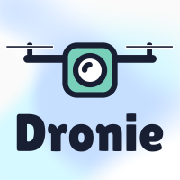

<!-- <h1 style="text-align: center"> Dronie </h1> -->

<h2 style="text-align: center"> Back End </h2>

---  

<h3 style="text-align: center"> Welcome to Dronie </h3>

#### Table of Contents 
* [About](#about)
* [Running the App Locally](#running-the-app)
* [Contributing](#contributing)

#### About

Dronie was developed as the Flatiron School Software Engineering capstone project by Daniel Sasse. The client interface of this app is built with React functional components and utilizes the Ionic Framework in order to leverage Ionic's cross-deployment abilities as a web-app and native iOS and Android apps. Redux is incorporated for global state managment across the app, and custom Styled and Ionic components were used for styling. Javascript Web Tokens are used to monitor authentication for all routes and actions.

The client interface connects to a Rails API server which is used to persist data to a PostgreSQL database and to manage websockets for the live chat system through ActionCable and Redis. The client interface also connects to the Cloudinary API to upload and retrieve image content. The repo link for the React client-interface can be found [here]("https://github.com/dsasse07/dronie-frontend")

[Back to Top](#table-of-contents)

#### Running the App

* Fork and clone this repo
* Fork and clone the [client interface repo](https://github.com/dsasse07/dronie-frontend)  
* `cd` into the backend directory
* Run `bundle install` to install required gems
* Run `rails db:create` to initialize a PostgreSQL if this is the first time running the app. 
* Run `rails db:migrate` to build the database schema
* Run `rails db:seed` to initialize the seed data if desired (not necessary)
* Generate a secret to use for the Javascript Web Token encoding by running `rake secret` in the terminal.
  * Copy this secret and store it into an environment variable in your `.env` file using the key `JWT_SECRET`
  * Ex: `JWT_SECRET=**********************************************`
  * If deploying to Heroku, a second environment variable will be needed which contains the `REDISTOGO_URL` for the live chat websocket server.
    * Follow the instructions from [Heroku here](https://blog.heroku.com/real_time_rails_implementing_websockets_in_rails_5_with_action_cable#what-are-websockets) and store the redis url in the `.env` file
    * Ex: `REDISTOGO_URL=redis://**********************`
* Run `rails s` to start the API server on `http://localhost:3000`

[Back to Top](#table-of-contents)

### Contributing
Pull requests are welcome. Please make sure that your PR is <a href="https://www.netlify.com/blog/2020/03/31/how-to-scope-down-prs/">well-scoped</a>. For major changes, please open an issue first to discuss what you would like to change.

#### Known issues
* <a href="https://github.com/dsasse07/dronie-backend/issues">Visit Issues Section</a> 

#### Contributors
<table>
  <tr>
    <td align="center"><a href="https://github.com/dsasse07"> <b>Daniel Sasse</b></a> 
    </tr>

[Back to Top](#table-of-contents)